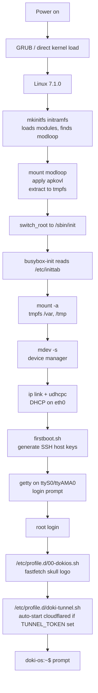

# Architecture

This page explains how DokiOS is structured internally.

## High-Level Diagram



## Image Layout

DokiOS images are 600MB raw disk images with a Master Boot Record (MBR) partition table:

```
dokios-0.10.0-x86_64.img (600MB)
├── MBR (512 bytes)
├── Partition 1: FAT32 boot (200MB, starts at sector 2048)
│   ├── vmlinuz                       (12MB, x86_64 compressed kernel)
│   ├── initramfs                     (6.6MB, mkinitfs initramfs)
│   ├── modloop                       (75MB, squashfs of rootfs)
│   └── grub/                          (GRUB 2.06 bootloader)
│       ├── grub.cfg
│       └── i386-pc/                   (GRUB modules)
└── Partition 2: ext4 root (400MB, starts at sector 411648)
    ├── bin/, sbin/, usr/, etc/, var/, home/, root/, opt/
    ├── /sbin/init → /bin/busybox
    ├── /etc/fstab                     (root + tmpfs /var, /tmp)
    ├── /etc/os-release                (DokiOS 0.10.0)
    ├── /etc/motd                      (skull ASCII)
    ├── /etc/profile.d/00-dokios.sh    (fastfetch on login)
    ├── /etc/profile.d/doki-tunnel.sh  (cloudflared auto-start)
    ├── /etc/fastfetch/config.jsonc    (fastfetch config)
    ├── /etc/fastfetch/logo.txt         (skull ASCII)
    ├── /etc/ssh/sshd_config           (custom OpenSSH config)
    ├── /etc/local.d/firstboot.sh      (first-boot setup)
    └── /var/cache/apk/                (apk package cache)
```

## Boot Flow in Detail

### Stage 1: Firmware → GRUB → Kernel

1. **Firmware/BIOS** initializes hardware and looks for MBR
2. **MBR** loads GRUB stage 1 (440 bytes)
3. **GRUB stage 1.5** reads filesystem drivers
4. **GRUB stage 2** reads `/grub/grub.cfg`:
   ```
   menuentry "DokiOS 0.10.0 (kernel 7.1.0)" {
       linux /vmlinuz modules=loop,squashfs,sd-mod,usb-storage,virtio_blk \
             console=ttyS0,115200 net.ifnames=0 \
             root=UUID=... rootfstype=ext4 rootflags=rw,relatime
       initrd /initramfs
   }
   ```
5. **GRUB** loads `vmlinuz` and `initramfs` into memory
6. **Kernel** boots, decompresses itself, initializes hardware

For ARM64/ARMv7, there's no GRUB — the bootloader (U-Boot on real hardware, QEMU `-kernel` on emulated) loads the kernel directly.

### Stage 2: mkinitfs Initramfs

The `initramfs` is a gzipped cpio archive containing a minimal Alpine filesystem:

```
/init                        (mkinitfs 3.14.0 init script)
/bin/busybox                 (static busybox binary)
/usr/sbin/nlplug-findfs      (block device discovery)
/lib/modules/7.1.0-.../       (kernel modules)
/etc/mdev.conf
```

The `init` script:
1. Loads kernel modules from `/lib/modules/`
2. Parses kernel command line (`KOPT_*` variables)
3. Runs `nlplug-findfs` to find the boot media (modloop)
4. Mounts the modloop (squashfs) on `/media/`
5. Applies the apkovl overlay (`/media/*/doki-os.apkovl.tar.gz`)
6. Installs packages listed in the apkovl `/etc/apk/world` from the modloop
7. `switch_root` to the new root filesystem at `/sbin/init`

### Stage 3: busybox-init (DokiOS Init)

The kernel runs `/sbin/init` which is a symlink to `/bin/busybox`. busybox-init reads `/etc/inittab`:

```sh
::sysinit:/bin/busybox mount -a
::sysinit:/bin/busybox mdev -s
::sysinit:/bin/busybox ip link set lo up
::wait:/bin/busybox ip link set eth0 up
::wait:/bin/busybox udhcpc -i eth0 -t 5 -n -q
::wait:/bin/sh /etc/local.d/firstboot.sh
ttyS0::respawn:/sbin/getty -L 0 ttyS0 vt100
::ctrlaltdel:/sbin/reboot
::shutdown:/bin/busybox umount -a -r
```

For ARM64/ARMv7, the console is `ttyAMA0` instead of `ttyS0`.

`firstboot.sh` runs on every boot but is idempotent (marker at `/etc/dokios-firstboot-done`):

```sh
#!/bin/sh
MARKER=/etc/dokios-firstboot-done
if [ -f "$MARKER" ]; then exit 0; fi

# Generate SSH host keys (only first time)
if [ ! -f /etc/ssh/ssh_host_rsa_key ]; then
    ssh-keygen -A
fi

# Create privilege separation dir
mkdir -p /var/empty
chmod 755 /var/empty

# Create root SSH dir
mkdir -p /root/.ssh
chmod 700 /root/.ssh
touch /root/.ssh/authorized_keys
chmod 600 /root/.ssh/authorized_keys

# Marker persists
touch "$MARKER"
```

### Stage 4: getty → Login → Shell

1. `getty` waits for a login on `ttyS0`/`ttyAMA0`
2. User types `root` (no password)
3. `login` validates against `/etc/shadow` (root has empty password)
4. Shell starts: `bash` (default for root in `/etc/passwd`)
5. `/etc/profile` runs, which sources `/etc/profile.d/*.sh` in alphabetical order

The profile scripts:

- `00-bashrc.sh` (Alpine default)
- `00-dokios.sh` — runs `fastfetch` with the skull logo
- `20locale.sh` (Alpine default)
- `color_prompt.sh.disabled` (Alpine default, disabled)
- `doki-tunnel.sh` — auto-starts cloudflared if `TUNNEL_TOKEN` env var or `/etc/doki-tunnel.conf` is set

## Kernel Configuration

The DokiOS kernel is based on Alpine's `linux-virt` with these custom options:

### Required Built-in (Y)

These features must be built-in (not modules) to avoid boot-time module loading delays:

| Option | Why |
|:-------|:----|
| `CONFIG_EXT4_FS=y` | ext4 root filesystem |
| `CONFIG_JBD2=y` | ext4 journal (dependency) |
| `CONFIG_SQUASHFS=y` | modloop support |
| `CONFIG_OVERLAYFS=y` | container support |
| `CONFIG_VIRTIO_BLK=y` | QEMU virtio disk |
| `CONFIG_NF_TABLES=y` | nftables firewall |
| `CONFIG_BRIDGE=y` | bridge networking |
| `CONFIG_9P_FS=y` | 9p filesystem for VM-host sharing |
| `CONFIG_TMPFS_POSIX_ACL=y` | tmpfs with POSIX ACLs |
| `CONFIG_CGROUPS=y` | cgroup v2 for container limits |
| `CONFIG_NAMESPACES=y` | All 7 namespace types |
| `CONFIG_SECCOMP=y` | seccomp-BPF for isolation |
| `CONFIG_LANDLOCK=y` | Landlock LSM sandboxing |

### Per-Architecture

| Option | x86_64 | aarch64 | armv7 |
|:-------|:-------|:-------:|:-----:|
| `CONFIG_VIRTIO_MMIO` | y | y | y |
| `CONFIG_VIRTIO_NET` | y | y | y |
| `CONFIG_SCSI_VIRTIO` | n | n | n |
| `CONFIG_SERIO` | y | n | n |
| `CONFIG_DEVTMPFS` | y | y | y |

## Read-Write Override

The Alpine `mkinitfs` 3.14.0 init script adds `ro` to the root mount options:

```sh
# Original (forces ro):
rootflags="${KOPT_rootflags:+$KOPT_rootflags,}ro"
$MOCK mount -o "${KOPT_rootflags:-ro}" ...

# DokiOS patch (respects rootflags from cmdline):
rootflags="${KOPT_rootflags:+$KOPT_rootflags,}"
$MOCK mount -o "${KOPT_rootflags:-rw}" ...
```

This allows the ext4 root to be mounted read-write from boot, enabling:
- Persistent `/var` (apk cache, sshd state)
- `apk add` runtime changes
- `/etc/dokios-firstboot-done` marker
- `authorized_keys` persistence

The patched initramfs is regenerated during build, and the kernel cmdline includes `rootflags=rw,relatime`.

## Init System: busybox vs OpenRC

DokiOS uses **busybox-init** instead of OpenRC.

**Why not OpenRC?**
- OpenRC 0.63.2 hangs at "Starting default runlevel" in this environment
- Likely a service dependency loop or missing dependency
- Reproducible across all 3 architectures

**busybox-init advantages:**
- Minimal (one binary, ~900 KB)
- No service supervisor (each service is just a process)
- Fast boot (<3 seconds)
- Predictable
- POSIX-compliant `/etc/inittab` syntax

**busybox-init disadvantages:**
- No automatic service restart
- No dependency resolution between services
- No service status (have to grep `ps`)
- Service startup order is manual

For long-running services, use the `::respawn:` directive in inittab:

```sh
::respawn:/usr/bin/dokid > /var/log/dokid.log 2>&1
```

This makes busybox-init restart the service if it exits.

## Customization Layer

The customization is applied via 3 mechanisms:

### 1. `/etc` files in the squashfs modloop

Files like `/etc/os-release`, `/etc/motd`, `/etc/profile.d/*.sh` are baked into the modloop. They become the base for the extracted rootfs.

### 2. Files in the ext4 root partition

After extracting the modloop, additional files (e.g., SSH host keys generated on first boot) live in the ext4 partition. These persist across reboots.

### 3. apkovl overlay (optional)

A tarball in the boot partition (`/doki-os.apkovl.tar.gz`) can override any file in the modloop. Currently DokiOS uses this minimally — most customization is in the modloop.

## Package Set

DokiOS ships 109 packages from Alpine edge + 18 Doki binaries (3 archs × 6 binaries):

### Alpine Packages (Alpine edge, June 2026)

```
alpine-base, alpine-keys, alpine-release, apk-tools, busybox, busybox-suid, musl,
ca-certificates-bundle, openrc, iproute2, nftables, fuse-overlayfs, kmod, mdev-conf,
bash, zsh, openssh, openssh-client, git, curl, wget, bind-tools, neovim, fastfetch
```

### Doki Binaries (upstream v0.10.0)

- `doki` — CLI (6.7-8.4 MB)
- `dokid` — Daemon (8.6-9.3 MB)
- `doki-compose` — Compose CLI (7.2-7.8 MB)
- `doki-init` — PID 1 for containers (2.7-2.8 MB)
- `doki-kube` — Kubernetes control plane (6.0-6.5 MB)
- `doki-kubectl` — kubectl-compatible CLI (5.7-6.1 MB)

Total: ~100 MB of Doki binaries, ~80 MB of Alpine packages compressed into 33-75 MB modloop.

## File System Hierarchy

```
/
├── bin/                    # Essential binaries (busybox + Doki)
├── sbin/                   # System binaries
│   └── init → ../bin/busybox
├── usr/
│   ├── bin/                # User binaries (bash, zsh, nvim, git, curl, doki, etc.)
│   ├── sbin/               # User system binaries (sshd)
│   ├── lib/                # Libraries
│   ├── share/              # Shared data (fastfetch, udhcpc, terminfo)
│   └── local/bin/          # Local binaries (doki-tunnel)
├── etc/
│   ├── alpine-release
│   ├── apk/                # Alpine package manager
│   ├── fastfetch/          # fastfetch config + logo
│   ├── init.d/             # OpenRC services (not used, but kept for compat)
│   ├── local.d/            # Local scripts (firstboot.sh)
│   ├── modprobe.d/
│   ├── motd                # Skull ASCII art
│   ├── network/            # interfaces
│   ├── os-release          # DokiOS identification
│   ├── passwd, shadow      # Users
│   ├── profile.d/          # Shell init scripts
│   ├── resolv.conf
│   ├── runlevels/          # OpenRC runlevel symlinks (not used)
│   ├── securetty
│   ├── shells
│   ├── ssh/                # SSH server config + host keys (after firstboot)
│   ├── ssl/                # CA certificates
│   ├── sysctl.d/
│   ├── terminfo/
│   └── udhcpc/             # DHCP client config
├── root/                   # Root user home
│   └── .ssh/               # SSH keys (after firstboot)
├── var/
│   ├── cache/apk/          # Package cache (persistent)
│   └── empty/              # sshd privilege separation (after firstboot)
├── tmp/                    # tmpfs (cleared on reboot)
├── dev/                    # Device nodes (mdev -s)
├── proc/                   # procfs
├── sys/                    # sysfs
├── run/                    # tmpfs runtime data
└── media/                  # Boot media mount point (transient)
```
