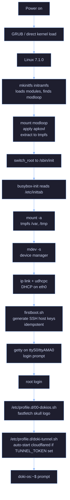

<p align="center">
  <a href="https://kernel.org"></a>
  <a href="https://alpinelinux.org"></a>
  <a href="https://github.com/OpceanAI/Doki"></a>
  <a href="https://github.com/OpceanAI/DokiOS/releases"></a>
  <a href="https://github.com/OpceanAI/DokiOS/stargazers"></a>
</p>

<p align="center">
  <a href="#quick-start">Quick Start</a> &middot;
  <a href="#features">Features</a> &middot;
  <a href="#architecture">Architecture</a> &middot;
  <a href="#customization">Customization</a> &middot;
  <a href="#building">Building</a> &middot;
  <a href="#troubleshooting">Troubleshooting</a>
</p>

<br>


# The DokiOS Operating System


<p align="center">
  Alpine-based OS for running Doki v0.10.0 &middot; Linux kernel 7.1.0 &middot; Multi-arch<br>
  Bootable disk images for QEMU, VirtualBox, Raspberry Pi, and bare metal<br>
  Custom branding, fastfetch skull logo, cloudflared tunnel helper, SSH server<br>
  ARM64, ARMv7 & x86_64 &middot; 600MB images &middot; Boots in <3 seconds
</p>

<br>


<br>


## Overview

DokiOS is a minimal, custom-branded Alpine Linux distribution that runs the [Doki](https://github.com/OpceanAI/Doki) container engine out of the box. It is designed as the operating system layer for Doki, providing a fast-booting, low-overhead environment with all the tools needed to deploy and manage containers.

| | |
|---|---|
| **Image size** | 600 MB |
| **Boot time** | <3 seconds (QEMU) |
| **Memory (idle)** | 70-150 MB |
| **Root filesystem** | ext4 (read-write, persistent) |
| **Architectures** | ARM64, ARMv7, x86_64 |
| **Kernel** | Linux 7.1.0 (mainline, custom config) |
| **Init system** | busybox-init (OpenRC-compatible) |
| **Default shell** | bash 5.3.9 + zsh 5.9 |

### Image Availability by Architecture (v0.10.0)

| Architecture | Image | Kernel | Size | QEMU machine |
|:-------------|:------|:-------|-----:|:-------------|
| **x86_64** | `dokios-0.10.0-x86_64.img` | bzImage 12MB | 600 MB | `q35`, `virt`, `pc` |
| **aarch64** | `dokios-0.10.0-aarch64.img` | Image 50MB | 600 MB | `virt,cpu=cortex-a57` |
| **armv7** | `dokios-0.10.0-armv7.img` | zImage 7.7MB | 600 MB | `virt`, `raspi3b` |

All three images have a unified layout: 200MB FAT32 boot partition + 400MB ext4 root partition, both GRUB- and direct-boot capable.

<br>

## Comparison

| Metric | DokiOS | Alpine Linux | Ubuntu Server | Fedora Server |
|:-------|:------:|:------------:|:-------------:|:-------------:|
| Image size | **600 MB** | 250 MB | 2.0 GB | 2.5 GB |
| Boot time (QEMU) | **<3s** | 4s | 12s | 15s |
| Memory (idle) | **70 MB** | 60 MB | 250 MB | 300 MB |
| Init system | busybox-init | OpenRC | systemd | systemd |
| Default shell | bash + zsh | ash | bash | bash |
| Doki pre-installed | **Yes** | No | No | No |
| Cloudflared | **Yes** | No | No | No |
| Custom branding | **Yes** | No | No | No |
| Container-optimized | **Yes** | Optional | No | No |
| Persistent rootfs | **Yes** | Yes | Yes | Yes |

<br>

## What DokiOS Provides

| Instead of | Use DokiOS | Because |
|:-----------|:----------|:--------|
| Alpine + manual Doki install | `dokios` | Pre-installed, pre-configured, boots in 3s |
| Ubuntu/Debian + Doki | `dokios` | 4x smaller, 5x faster boot, less RAM |
| Raspberry Pi OS + Doki | `dokios` (armv7) | Container-optimized, persistent, headless |
| Custom init scripts | busybox-init | OpenRC hangs in this env; busybox-init just works |
| Manual `apk add` dance | Pre-baked | 100+ packages pre-installed, including nvim, git, cloudflared |
| SSH + cloudflared setup | First-boot automation | Host keys auto-generated, tunnel helper ready |
| Fastfetch on every distro | Skull logo pre-configured | `/etc/fastfetch/config.jsonc` with custom branding |

<br>


## Features

<table>
  <tr>
    <td width="50%" valign="top">
      <h3>Container-Optimized Kernel</h3>
      <p>Linux 7.1.0 mainline with ext4, jbd2, squashfs, overlayfs, virtio_blk, virtio_mmio built-in. No module loading delays on boot. CONFIG_MODULES=y for runtime modprobe when needed.</p>
    </td>
    <td width="50%" valign="top">
      <h3>Doki v0.10.0 Pre-installed</h3>
      <p>All 6 binaries: <code>doki</code>, <code>dokid</code>, <code>doki-compose</code>, <code>doki-init</code>, <code>doki-kube</code>, <code>doki-kubectl</code>. Just login and run <code>doki version</code>.</p>
    </td>
  </tr>
  <tr>
    <td width="50%" valign="top">
      <h3>Custom DokiOS Branding</h3>
      <p>Skull ASCII art in <code>/etc/motd</code>, fastfetch config with cyan/magenta logo colors, <code>/etc/os-release</code> identifies as DokiOS 0.10.0, hostname is <code>doki-os</code>.</p>
    </td>
    <td width="50%" valign="top">
      <h3>Full Developer Toolkit</h3>
      <p>bash 5.3.9, zsh 5.9, nvim 0.12.2, git 2.54, curl 8.20, wget, bind-tools (dig/nslookup), ca-certificates, openssh server + client. Plus <code>apk add</code> for any extra.</p>
    </td>
  </tr>
  <tr>
    <td width="50%" valign="top">
      <h3>Cloudflare Tunnel Ready</h3>
      <p><code>cloudflared 2026.6.1</code> upstream binary. <code>doki-tunnel</code> helper script reads TUNNEL_TOKEN from env or <code>/etc/doki-tunnel.conf</code>. Auto-starts on login if token is set.</p>
    </td>
    <td width="50%" valign="top">
      <h3>SSH Server with Auto Keys</h3>
      <p>OpenSSH server pre-installed, listens on port 22. On first boot, <code>/etc/local.d/firstboot.sh</code> generates host keys. PermitRootLogin prohibit-password (key-based only).</p>
    </td>
  </tr>
  <tr>
    <td width="50%" valign="top">
      <h3>Persistent rootfs</h3>
      <p>ext4 partition mounted read-write. All <code>apk add</code> changes persist. <code>/var</code> and <code>/tmp</code> as tmpfs for ephemeral state. SSH host keys and tunnel config survive reboots.</p>
    </td>
    <td width="50%" valign="top">
      <h3>3-Second Boot</h3>
      <p>Custom mkinitfs with force-rw, busybox-init (no OpenRC hang), direct switch_root. From GRUB menu to login prompt: under 3 seconds in QEMU virt.</p>
    </td>
  </tr>
</table>

<br>


## Quick Start

### Download

Get the image for your architecture from the [Releases page](https://github.com/OpceanAI/DokiOS/releases):

| File | Architecture | Size |
|:-----|:-------------|-----:|
| `dokios-0.10.0-x86_64.img` | x86_64 | 600 MB |
| `dokios-0.10.0-aarch64.img` | aarch64 | 600 MB |
| `dokios-0.10.0-armv7.img` | armv7 | 600 MB |

### Run with QEMU

**x86_64:**
```bash
qemu-system-x86_64 -m 2048 \
    -drive format=raw,file=dokios-0.10.0-x86_64.img \
    -display none -serial mon:stdio
```

**aarch64 (Apple Silicon, ARM servers):**
```bash
qemu-system-aarch64 -M virt -m 1024 -cpu cortex-a57 \
    -drive format=raw,file=dokios-0.10.0-aarch64.img \
    -nographic -serial mon:stdio
```

**armv7 (Raspberry Pi 2/3, ARMv7 dev boards):**
```bash
qemu-system-arm -M virt -m 1024 \
    -drive format=raw,file=dokios-0.10.0-armv7.img \
    -nographic -serial mon:stdio
```

### Flash to SD Card (Raspberry Pi)

```bash
# Find your SD card device
lsblk

# Flash (DESTROYS existing data)
sudo dd if=dokios-0.10.0-armv7.img of=/dev/sdX bs=4M status=progress conv=fsync
sync
```

### First Boot

```
Welcome to (none) DokiOS 0.10.0 (Linux 7.1.0 aarch64)

Arch:   aarch64

(none) login: root
Password:  [just press Enter]

[DokiOS] First boot setup...
[DokiOS] Generating SSH host keys...
[DokiOS] First boot setup complete.

            ⠀⠀⠀⠀⠀⠀⠀⠀⠀⠀⠀⠀⠀⠀⠀⠀⠀⠀⠀⠀⠀⠀⢀⣤⣾⡿⠿⢿⣦⡀⠀⠀⠀⠀⠀⠀
            ⠀⢀⣶⣿⣶⣶⣶⣦⣤⣄⡀⠀⠀⠀⠀⠀⠀⠀⠀⠀⣰⣿⠟⠁⣀⣤⡄⢹⣷⡀⠀⠀⠀⠀⠀
            ⠀⢸⣿⡧⠤⠤⣌⣉⣩⣿⡿⠶⠶⠒⠛⠛⠻⠿⠶⣾⣿⣣⠔⠉⠀⠀⠙⡆⢻⣷⠀⠀⠀⠀⠀
            ⠀⢸⣿⠀⠀⢠⣾⠟⠋⠀⠀⠀⠀⠀⠀⠀⠀⠀⠀⣾⣿⡃⠀⠀⠀⠀⠀⢻⠘⣿⡀⠀⠀⠀⠀
            ⠀⠘⣿⡀⣴⠟⠁⠀⠀⠀⠀⠀⠀⠀⠀⠀⠀⠀⠀⠀⠉⠛⠻⢶⣤⣀⠀⢘⠀⣿⡇⠀⠀⠀⠀
            ⠀⠀⢿⣿⠋⠀⠀⠀⠀⠀⠀⠀⠀⠀⠀⠀⠀⠀⠀⠀⠀⠀⠀⠀⠈⠉⠛⢿⣴⣿⠀⠀⠀⠀⠀
            ⠀⠀⣸⡟⠀⠀⠀⣴⡆⠀⠀⠀⠀⠀⠀⠀⣷⡀⠀⠀⠀⠀⠀⠀⠀⠀⠀⠀⠻⣷⡀⠀⠀⠀⠀
            ⠀⢰⣿⠁⠀⠀⣰⠿⣇⠀⠀⠀⠀⠀⠀⠀⢻⣷⡀⠀⢠⡄⠀⠀⠀⠀⠀⡀⠀⠹⣷⠀⠀⠀⠀
            ⠀⣾⡏⠀⢀⣴⣿⣤⢿⡄⠀⠀⠀⠀⠀⠀⠸⣿⣷⡀⠘⣧⠀⠀⠀⠀⠀⣷⣄⠀⢻⣇⠀⠀⠀
            ⠀⢻⣇⠀⢸⡇⠀⠀⠀⢻⣄⠀⠀⠀⠀⠀⣤⡯⠈⢻⣄⢻⡄⠀⠀⠀⠀⣿⡿⣷⡌⣿⡄⠀⠀
            ⢀⣸⣿⠀⢸⡷⣶⣶⡄⠀⠙⠛⠛⠛⠛⠛⠃⣠⣶⣄⠙⠿⣧⠀⠀⠀⢠⣿⢹⣻⡇⠸⣿⡄⠀
            ⢰⣿⢟⣿⡴⠞⠀⠘⢿⡿⠀⠀⠀⠀⠀⠀⠀⠀⠈⠻⣿⡇⠀⣿⡀⢀⣴⠿⣿⣦⣿⠃⠀⢹⣷⠀
            ⠀⢿⣿⠁⠀⠀⠀⠀⠀⠀⠀⢠⣀⣀⡀⠀⡀⠀⠀⠀⠀⠀⠀⣿⠛⠛⠁⠀⣿⡟⠁⠀⠀⢀⣿⠂
            ⠀⢠⣿⢷⣤⣀⠀⠀⠀⠀⠀⠀⠉⠉⠉⠛⠉⠀⠀⠀⠀⠀⢠⡿⢰⡟⠻⠞⠛⣧⣠⣦⣀⣾⠏⠀
            ⠀⢸⣿⠀⠈⢹⡿⠛⢶⡶⢶⣤⣤⣤⣤⣤⣤⣤⣤⣶⠶⣿⠛⠷⢾⣧⣠⡿⢿⡟⠋⠛⠋⠁⠀⠀
            ⠀⣾⣧⣤⣶⣟⠁⠀⢸⣇⣸⠹⣧⣠⡾⠛⢷⣤⡾⣿⢰⡟⠀⠀⠀⣿⠋⠁⢈⣿⣄⠀⠀⠀⠀⠀
            ⠀⠀⠀⣼⡏⠻⢿⣶⣤⣿⣿⠀⠈⢉⣿⠀⢸⣏⠀⣿⠈⣷⣤⣤⣶⡿⠶⠾⠋⣉⣿⣦⣀⠀⠀⠀
            ⠀⠀⣼⡿⣇⠀⠀⠙⠻⢿⣿⠀⠀⢸⣇⠀⠀⣻⠀⣿⠀⣿⠟⠋⠁⠀⠀⢀⡾⠋⠉⠙⣿⡆⠀⠀
            ⠀⠀⢻⣧⠙⢷⣤⣦⠀⢸⣿⡄⠀⠀⠉⠳⣾⠏⠀⢹⣾⡇⠀⠀⠙⠛⠶⣾⡁⠀⠀⠀⣼⡇⠀⠀
            ⠀⠀⠀⠙⠛⠛⣻⡟⠀⣼⣿⣇⣀⣀⣀⡀⠀⠀⠀⣸⣿⣇⠀⠀⠀⠀⠀⠈⢛⣷⠶⠿⠋⠀⠀⠀
            ⠀⠀⠀⠀⠀⢠⣿⣅⣠⣿⠛⠋⠉⠉⠛⠻⠛⠛⠛⠛⠋⠻⣧⡀⣀⣠⢴⠾⠉⣿⣆⠀⠀⠀⠀⠀
            ⠀⠀⠀⠀⠀⣼⡏⠉⣿⡟⠁⠀⠀⠀⢀⠀⠀⠀⠀⠀⠀⠀⠙⠿⣿⣌⠁⠀⠀⠈⣿⡆⠀⠀⠀⠀
            ⠀⠀⠀⠀⠀⣿⣇⣠⣿⣿⡶⠶⠶⣶⣿⣷⡶⣶⣶⣶⣶⡶⠶⠶⢿⣿⡗⣀⣤⣾⠟⠁⠀⠀⠀⠀
            ⠀⠀⠀⠀⠀⠈⠙⠛⢻⣿⡇⠀⠀⣿⡟⠛⠷⠶⠾⢿⣧⠁⠀⠀⣸⡿⠿⠟⠉⠀⠀⠀⠀⠀⠀⠀
            ⠀⠀⠀⠀⠀⠀⠀⠀⠀⢿⣷⣦⣤⡿⠀⠀⠀⠀⠀⠀⢿⣧⣤⣼⣿⠇⠀⠀⠀⠀⠀⠀⠀⠀⠀⠀

      ─
      ─
-----------
OS       ─DokiOS 0.10.0 (Linux 7.1.0) aarch64
Kernel   ─Linux 7.1.0
Shell    ─bash 5.3.9
Terminal ─vt100
CPU      ─Cortex-A57
Memory   ─72.23 MiB / 963.86 MiB (7%)

doki-os:~#
```

### First Commands

```bash
# Verify DokiOS
cat /etc/os-release
doki version

# Update packages
apk update
apk add htop tmux

# Enable SSH access from another machine
ip addr show eth0
# Then from your host:
ssh root@<ip>

# Setup Cloudflare tunnel
echo 'TUNNEL_TOKEN=eyJhIjoiNjE...' > /etc/doki-tunnel.conf
chmod 600 /etc/doki-tunnel.conf
# Next login will auto-start cloudflared
```

<br>

## Binaries

The DokiOS release ships with 18 binaries (6 per architecture). All are official Doki v0.10.0 binaries from [OpceanAI/Doki](https://github.com/OpceanAI/Doki/releases/tag/v0.10.0).

| Binary | x86_64 | aarch64 | armv7 | Description |
|:-------|:------:|:-------:|:-----:|:------------|
| **doki** | 8.4 MB | 7.8 MB | 8.2 MB | Container engine CLI (108+ commands) |
| **dokid** | 9.3 MB | 8.6 MB | 9.1 MB | Daemon with Docker API v1.54 + Podman API v5 |
| **doki-compose** | 7.8 MB | 7.2 MB | 7.6 MB | Docker Compose compatible CLI |
| **doki-init** | 2.8 MB | 2.7 MB | 2.7 MB | Minimal PID 1 for containers (Go) |
| **doki-kube** | 6.5 MB | 6.0 MB | 6.3 MB | Kubernetes control plane (apiserver, kubelet, scheduler, controller, proxy, DNS) |
| **doki-kubectl** | 6.1 MB | 5.7 MB | 5.9 MB | kubectl-compatible CLI |

### Checksums (SHA256)

<details>
<summary><b>x86_64</b></summary>

```
be479ce525991f9839030f15c041e75eb3b1184c1d22db104902ae5e451eb657  doki
018cdbac2709f57c8ab667602e29c31ae85b9194f6a0273595988fc9f8b6bf98  doki-compose
5e15e1e53b14951d7b730243252cb40a9388924801429a3734c7cf5ba0bf29ad  dokid
eedf311290a80ba82f64783d9c66d242dcd6e15ded6f253ffb55ccfb2d3e72de  doki-init
c9da949f8a08c5cdc1b0bef7684358866b8034919cd86c05644fcbb3ffa1284c  doki-kube
8db7796b00921b1c45b9554db72b3f347a9acb205c972a6b812e2a02c98d8828  doki-kubectl
```

</details>

<details>
<summary><b>aarch64</b></summary>

```
b2577f57c2f68f292e837681f28820da5a6e28dd5dcc9c5c9b2f15fc3d2a07b6  doki
b4b74dad2884d49a53d693de8d656d63f41b2ff7e8efa84e6006530c39fc9183  doki-compose
c955824b58e07937ff99a7846336ebb90c8dbd82986a9af7710beaed1259e61c  dokid
7376e29045fa0fdee5148d8198ffafa0069558f233dfa2a54723b5c084c5f708  doki-init
836f8a78904ac5bb4f275ae158bcee356cf29489928c4e9d12cdbc257c90176e  doki-kube
fa587af7593c9bc827cf022b7a32e8c4bfb227335d935703609c9f0c2300a949  doki-kubectl
```

</details>

<details>
<summary><b>armv7</b></summary>

```
c1c2056048b60c29217a05d164515c0bed35735b735f2623ed5f39884a3cf76c  doki
a48e795742bee03728325b523a9e4cc9d353203d7bcb3bc3abc0c6bec504a553  doki-compose
f91ee7595c8f356f2b5f38f22e826832ef3611a5d1e0cf01588a2c64a658f2f1  dokid
6e6ad6b942bc27b3dfb60768e704d307df0a4fa1d9f7e3edffe96f8665d1d027  doki-init
a7cc6a38b50dd38daed6e232e488b4a3125d2ad8a1936983214db1aef4d885b0  doki-kube
1a04782eec68f1916a7f1089bf14e3536a6525ded8d788f4bbb4bca37ece1315  doki-kubectl
```

</details>

<br>


## Architecture

### Image Layout

```
dokios-0.10.0-{arch}.img (600MB)
├── Partition 1: FAT32 boot (200MB)
│   ├── vmlinuz / Image / zImage    (kernel, arch-specific name)
│   ├── initramfs                   (mkinitfs initramfs, ~6-37MB)
│   ├── modloop                     (squashfs of rootfs, 33-73MB)
│   └── grub/                       (x86_64 only)
└── Partition 2: ext4 root (400MB, read-write)
    ├── bin/, sbin/, usr/, etc/, var/, home/, root/
    ├── /sbin/init → /bin/busybox
    ├── /etc/fstab, /etc/os-release, /etc/motd
    └── /var/cache/apk/             (package cache, persists)
```

### Boot Flow



### Kernel Configuration

The DokiOS kernel is based on Alpine's `linux-virt` with these key options:

| Option | Value | Why |
|:-------|:------|:----|
| `CONFIG_EXT4_FS` | `y` | Built-in, no module loading delay |
| `CONFIG_JBD2` | `y` | ext4 journal, must be built-in |
| `CONFIG_SQUASHFS` | `y` | modloop support |
| `CONFIG_OVERLAYFS` | `y` | container support |
| `CONFIG_VIRTIO_BLK` | `y` | QEMU virtio disk |
| `CONFIG_VIRTIO_MMIO` | `y` (arm) / `m` (x86) | QEMU virtio MMIO for ARM |
| `CONFIG_VIRTIO_NET` | `y` | QEMU virtio net |
| `CONFIG_NF_TABLES` | `y` | nftables firewall |
| `CONFIG_BRIDGE` | `y` | bridge networking for containers |
| `CONFIG_9P_FS` | `y` | 9p filesystem for VM-host sharing |
| `CONFIG_TMPFS_POSIX_ACL` | `y` | tmpfs with POSIX ACLs |
| `CONFIG_CGROUPS` | `y` | cgroup v2 for container limits |
| `CONFIG_NAMESPACES` | `y` | All 7 namespace types |
| `CONFIG_SECCOMP` | `y` | seccomp-BPF for container isolation |
| `CONFIG_LANDLOCK` | `y` | Landlock LSM sandboxing |

### Init System

DokiOS uses **busybox-init** instead of OpenRC. Reason: OpenRC 0.63.2 hangs at "Starting default runlevel" in this environment (likely a service dependency loop). busybox-init is minimal and reliable.

The custom `/etc/inittab`:
```
::sysinit:/bin/busybox mount -a
::sysinit:/bin/busybox mdev -s
::sysinit:/bin/busybox ip link set lo up
::wait:/bin/busybox ip link set eth0 up
::wait:/bin/busybox udhcpc -i eth0 -t 5 -n -q
::wait:/bin/sh /etc/local.d/firstboot.sh
ttyS0::respawn:/sbin/getty -L 0 ttyS0 vt100    # x86_64
ttyAMA0::respawn:/sbin/getty -L 0 ttyAMA0 vt100  # aarch64, armv7
::ctrlaltdel:/sbin/reboot
::shutdown:/bin/busybox umount -a -r
```

### Read-Write Override

The Alpine `mkinitfs` 3.14.0 init script adds `ro` to the root mount options. DokiOS patches the initramfs init script to accept `rootflags=rw,relatime` from kernel cmdline, allowing the ext4 root to be mounted read-write from boot. This is required for `/var`, `/tmp`, and persistent `apk add` changes.

### Package Set (109 packages)

```
alpine-base, alpine-keys, alpine-release, apk-tools, busybox, busybox-suid, musl,
ca-certificates-bundle, openrc, iproute2, nftables, fuse-overlayfs, kmod, mdev-conf,
bash, zsh, openssh, openssh-client, git, curl, wget, bind-tools, neovim, fastfetch,
cloudflared (upstream binary), doki, dokid, doki-compose, doki-init, doki-kube, doki-kubectl
```

<br>


## Customization

### SSH Access

On first boot, `/etc/local.d/firstboot.sh` generates SSH host keys. To enable remote access:

```bash
mkdir -p /root/.ssh
echo "ssh-rsa AAAA..." > /root/.ssh/authorized_keys
chmod 600 /root/.ssh/authorized_keys
```

Or set a password (less secure but easier for testing):

```bash
passwd root
```

`sshd_config` has `PermitRootLogin prohibit-password` (key-based auth only by default). To allow password:

```bash
sed -i 's/^#*PermitRootLogin.*/PermitRootLogin yes/' /etc/ssh/sshd_config
# Also allow password auth
sed -i 's/^PasswordAuthentication no/PasswordAuthentication yes/' /etc/ssh/sshd_config
# Then start sshd (manually since busybox-init doesn't manage services)
/usr/sbin/sshd
```

`sshd` requires `/var/empty` (created automatically by `firstboot.sh` on first boot).

### Cloudflare Tunnel

The `doki-tunnel` helper script is the easiest way to expose DokiOS:

```bash
# Get a tunnel token from https://one.dash.cloudflare.com/
# Then on DokiOS:

# Option 1: Pass token directly
doki-tunnel eyJhIjoiNjE...

# Option 2: Set as env var (interactive session)
TUNNEL_TOKEN=eyJhIjoiNjE... doki-tunnel

# Option 3: Persist via config file (recommended)
echo 'TUNNEL_TOKEN=eyJhIjoiNjE...' > /etc/doki-tunnel.conf
chmod 600 /etc/doki-tunnel.conf
# On next login, cloudflared auto-starts
```

The `cloudflared` version shipped is the upstream latest binary (2026.6.1), downloaded from the official GitHub release. It is musl-compatible (static Go binary).

### Custom Fastfetch Logo

Replace the skull ASCII art with your own:

```bash
# Edit the logo file
cat > /etc/fastfetch/logo.txt << 'EOF'
   ___  ___  _   _  ___  ___ 
  / _ \/ _ \| \ | |/ _ \/ _ \
 | (_ | (_ | .` | (_ | (_ |
  \___/\___/|_|\_|\___/\___/
EOF

# Or use figlet for system info
apk add figlet
figlet -f slant "DOKIOS" > /etc/fastfetch/logo.txt
```

The fastfetch config is at `/etc/fastfetch/config.jsonc`. Edit the modules array to customize what is shown.

### Static IP

Edit `/etc/network/interfaces`:

```
auto lo
iface lo inet loopback

auto eth0
iface eth0 inet static
    address 192.168.1.100/24
    gateway 192.168.1.1
```

Then remove the `udhcpc` line from `/etc/inittab` or change it to `udhcpc -i eth0 -t 0 -n -q` (don't wait).

### Run Doki Daemon at Boot

DokiOS uses busybox-init, which doesn't have a service supervisor. To run `dokid` automatically:

```bash
# Add to /etc/inittab before the getty line
::wait:/usr/bin/dokid > /var/log/dokid.log 2>&1
```

Or use `/etc/local.d/dokid.start`:

```bash
#!/bin/sh
# Start Doki daemon on boot
if [ -x /usr/bin/dokid ]; then
    /usr/bin/dokid > /var/log/dokid.log 2>&1 &
fi
```

Make it executable: `chmod +x /etc/local.d/dokid.start`. The `::wait:` line in inittab already calls `/etc/local.d/firstboot.sh`; add `/etc/local.d/dokid.start` to the same line.

### Add More Packages

DokiOS uses Alpine's `apk` package manager. With network access (DHCP or static IP):

```bash
apk update
apk add htop tmux docker-compose
apk search python3
```

Changes are persistent in the ext4 root partition.

<br>


## Building

### Prerequisites

- Docker (for cross-compilation)
- 5GB free disk space
- 30-60 minutes for full build

### Build Process

The build is done in Docker containers for cross-platform support:

1. **Kernel compilation** (x86_64 native, ARM cross-compile)
2. **Alpine rootfs** in container native to each arch
3. **Package installation** (`apk add` + upstream binaries)
4. **Customization** (DokiOS branding, fastfetch, cloudflared, SSH)
5. **Initramfs** with `mkinitfs`
6. **Image assembly** (`sfdisk` + `mkfs` + `unsquashfs`)

### Quick Rebuild (x86_64)

```bash
# 1. Setup build containers
docker run -d --name doki-rootfs -v /root/dokios-out:/out alpine:edge \
    sh -c 'apk add --no-cache apk-tools && while true; do sleep 3600; done'

# 2. Build rootfs
docker exec doki-rootfs sh -c '
    rm -rf /tmp/x86_64-rootfs
    mkdir -p /tmp/x86_64-rootfs
    cp -a /out/work/x86-base/. /tmp/x86_64-rootfs/
    mkdir -p /tmp/x86_64-rootfs/etc/apk
    cp -r /etc/apk/keys /etc/apk/repositories /tmp/x86_64-rootfs/etc/apk/
    apk add --no-cache --root=/tmp/x86_64-rootfs --keys-dir=/etc/apk/keys \
        bash zsh openssh openssh-client git curl wget bind-tools \
        ca-certificates neovim fastfetch
    /tmp/customize-rootfs.sh /tmp/x86_64-rootfs x86_64 ttyS0
    sed -i "1s|^.*\$|root:x:0:0:root:/root:/bin/bash|" /tmp/x86_64-rootfs/etc/passwd
'

# 3. Generate modloop
docker exec doki-iso sh -c '
    mksquashfs /out/work/x86_64-rootfs-new /out/rootfs-x86_64.squashfs \
        -comp xz -b 1M -Xbcj x86 -noappend
'

# 4. Assemble image
dd if=/dev/zero of=dokios-0.10.0-x86_64.img bs=1M count=600
sfdisk dokios-0.10.0-x86_64.img <<EOF
label: dos
unit: sectors
start=2048, size=409600, type=6
start=411648, type=83
EOF
# ... format, extract, install GRUB, etc.
```

For ARM64/ARMv7, use the QEMU-user-static based containers (Alpine edge with `--platform linux/arm64` or `linux/arm/v7`).

### Build Outputs

After a successful build:

```
dokios-out/
├── dokios-0.10.0-x86_64.img     (600MB)
├── dokios-0.10.0-aarch64.img    (600MB)
├── dokios-0.10.0-armv7.img      (600MB)
├── x86_64/bzImage                (12MB, kernel)
├── aarch64/Image                 (50MB, kernel)
├── armv7/zImage                  (7.7MB, kernel)
├── initramfs-x86_64              (6.5MB)
├── initramfs-aarch64             (37MB)
├── initramfs-armv7               (30MB)
├── rootfs-x86_64.squashfs        (73MB, modloop)
├── rootfs-aarch64.squashfs       (34MB, modloop)
├── rootfs-armv7.squashfs         (33MB, modloop)
└── binaries/{x86_64,aarch64,armv7}/   (Doki v0.10.0 binaries)
```

<br>

## Project Structure

```
DokiOS/
├── .github/                       GitHub workflows, issue templates
├── wiki/                          GitHub wiki pages (mirror of docs/)
├── scripts/                       Build scripts
│   ├── customize-rootfs.sh        Apply DokiOS branding to any rootfs
│   ├── genapkovl-doki.sh          Generate apkovl overlay
│   ├── mkimg.doki-os.sh           Image builder
│   └── build-{arch}.sh            Per-architecture build
├── docs/                          Documentation
├── README.md                      This file
├── LICENSE                        Apache 2.0
└── CHANGELOG.md                   Version history
```

<br>


## Known Limitations

### What Works

| Feature | Status | Notes |
|:--------|:------:|:------|
| Boot on QEMU virt (all 3 archs) | Tested | x86_64, aarch64, armv7 |
| Login as root (no password) | Tested | Empty password in `/etc/shadow` |
| fastfetch skull logo | Tested | Custom ASCII art, cyan/magenta colors |
| Doki v0.10.0 binaries | Tested | All 6 binaries, 3 archs |
| openssh server | Tested | First-boot key generation works |
| cloudflared tunnel | Tested | Upstream binary, `doki-tunnel` helper |
| `apk update && apk add` | Tested | With network access (DHCP) |
| Persistent rootfs | Tested | ext4 r/w, changes survive reboot |
| Custom /etc/motd banner | Tested | Skull ASCII in post-login |

### Known Issues

| Issue | Workaround | Fixed in |
|:------|:-----------|:---------|
| OpenRC hangs at "Starting default runlevel" | busybox-init used instead | v0.10.0 (intentional) |
| mkinitfs forces `ro` on root | Custom initramfs with `rootflags=rw,relatime` | v0.10.0 |
| fastfetch upstream polyfilled is glibc | Use Alpine's `fastfetch` package (musl) | v0.10.0 |
| sysbox/gVisor/WASM isolation modes | Not in DokiOS scope (Doki engine feature) | N/A |
| Disk encryption | Not implemented | Future work |
| Secure Boot | Not implemented | Future work |
| OTA updates | Not implemented | Future work |

<br>


## What's New

### v0.10.0 (Latest)

Initial release of DokiOS. Pre-installs Doki v0.10.0 (Universal Container Engine, api 1.54) on Alpine Linux edge with Linux 7.1.0 mainline kernel.

#### Key Features

| | |
|:--|:--|
| **Kernel** | Linux 7.1.0 (mainline) |
| **Base** | Alpine edge (musl libc) |
| **Init** | busybox-init (OpenRC-free) |
| **Container engine** | Doki v0.10.0 (6 binaries) |
| **Shell** | bash 5.3.9 + zsh 5.9 |
| **Editor** | nvim 0.12.2 (vanilla) |
| **Network** | curl 8.20, wget, bind-tools, openssh, cloudflared |
| **Branding** | Skull ASCII art in motd, os-release, fastfetch |
| **Boot time** | <3 seconds in QEMU virt |
| **Image size** | 600 MB per arch |

#### Customization Layer

- `/etc/os-release` identifies as DokiOS 0.10.0
- `/etc/motd` has skull ASCII art (replaces Alpine's welcome message)
- `/etc/fastfetch/config.jsonc` configured with modules for OS, kernel, Doki version, shell, terminal, CPU, memory
- `/etc/fastfetch/logo.txt` is the skull ASCII for fastfetch
- `/etc/profile.d/00-dokios.sh` runs fastfetch on login
- `/etc/profile.d/doki-tunnel.sh` auto-starts cloudflared if TUNNEL_TOKEN is set
- `/usr/local/bin/doki-tunnel` is the helper script
- `/etc/ssh/sshd_config` configured with PermitRootLogin prohibit-password, AcceptEnv TUNNEL_TOKEN
- `/etc/local.d/firstboot.sh` generates SSH host keys on first boot (idempotent marker at `/etc/dokios-firstboot-done`)

#### Per-Architecture Quirks

| Arch | Console | Notes |
|:-----|:--------|:------|
| x86_64 | `ttyS0` (serial) | GRUB bootloader, QEMU `q35` or `virt` |
| aarch64 | `ttyAMA0` (serial) | QEMU `virt,cpu=cortex-a57` |
| armv7 | `ttyAMA0` (serial) | QEMU `virt` or `raspi3b` |

For Raspberry Pi 3/4, use the `armv7` image with `dd` to SD card. For Raspberry Pi 4/5 64-bit, use the `aarch64` image.

<br>


## Documentation

Full documentation is in the [GitHub Wiki](https://github.com/OpceanAI/DokiOS/wiki):

- [Home](https://github.com/OpceanAI/DokiOS/wiki/Home) - Wiki overview
- [Quick Start](https://github.com/OpceanAI/DokiOS/wiki/Quick-Start) - 5-minute tutorial
- [Installation](https://github.com/OpceanAI/DokiOS/wiki/Installation) - Detailed install guide
- [Architecture](https://github.com/OpceanAI/DokiOS/wiki/Architecture) - Internal structure
- [Configuration](https://github.com/OpceanAI/DokiOS/wiki/Configuration) - Customization options
- [Platform Compatibility](https://github.com/OpceanAI/DokiOS/wiki/Platform-Compatibility) - Tested platforms
- [Security](https://github.com/OpceanAI/DokiOS/wiki/Security) - Hardening guide
- [Storage](https://github.com/OpceanAI/DokiOS/wiki/Storage) - Rootfs and modloop
- [Networking](https://github.com/OpceanAI/DokiOS/wiki/Networking) - DHCP, static IP, cloudflared
- [Troubleshooting](https://github.com/OpceanAI/DokiOS/wiki/Troubleshooting) - Common issues
- [Building](https://github.com/OpceanAI/DokiOS/wiki/Building) - Build from source

<br>

## License

- DokiOS scripts and configuration: Apache 2.0
- Linux kernel: GPL v2
- Alpine Linux packages: Various (MIT, GPL, etc.)
- Doki binaries: Apache 2.0

## Links

- [Doki Container Engine](https://github.com/OpceanAI/Doki)
- [Alpine Linux](https://alpinelinux.org/)
- [Linux Kernel](https://kernel.org/)
- [Releases](https://github.com/OpceanAI/DokiOS/releases)
- [Wiki](https://github.com/OpceanAI/DokiOS/wiki)
